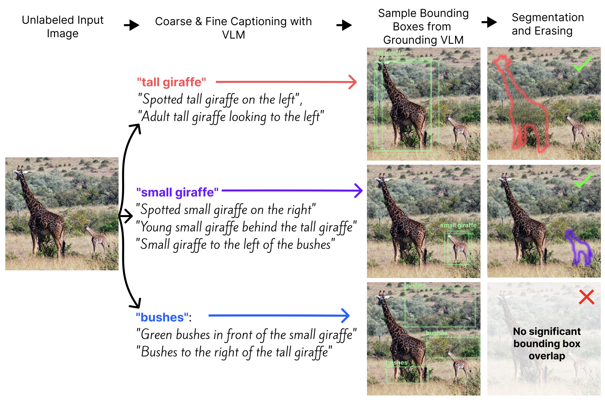

# EraseDraw Dataset

[Paper Website](https://erasedraw.cs.columbia.edu/) | [Paper PDF](https://erasedraw.cs.columbia.edu/static/files/erasedraw_arxiv.pdf) | [Stable Diffusion 1.5 Fine-Tune Weights](https://huggingface.co/alpercanberk/erasedraw)

This repository contains the code for downloading, loading, and generating the EraseDraw dataset from the paper '*EraseDraw: Learning to Insert Objects by Erasing Them from Images*'.

<p align="center">
  
</p>

To download the data, run `bash download_dataset.sh`. This will download the dataset (~15GB) to a local directory called `dataset-v1`. To see how you can load the dataset from a PyTorch dataloader, you may refer to `dataloader.py`, which only requires `webdataset`, `torch`, and `torchvision` packages.

# Dataset Format

The dataset is stored in WebDataset (WDS) format, split into multiple shards of approximately 1GB each. Each shard is a TAR file named `erasedraw-{dataset_name}-{XX}-wds.tar`, where `XX` is a zero-padded shard number.

Each editing task in the dataset, denoted by `[image_id]` contains a corresponding

2. `[image_id].original.jpg`: The original image in JPEG format.
3. `[image_id].json`: A JSON string with metadata:
   - `names`: A list of object names.
   - `prompts`: A list of lists containing prompts for each object.
4. `[image_id].edited.XX.jpg`: One or more edited images in JPEG format, where XX is a zero-padded two-digit index (e.g., edited.00.jpg, edited.01.jpg).
5. `[image_id].masks.XX.jpg` (Optional): One or more object masks in JPEG format, where XX is a zero-padded two-digit index (e.g., masks.00.jpg, masks.01.jpg). There should be as many masks as there are objects. When present, these files
are used for determining the image cropping bounding boxes.

# Generating Data

<p align="center">
  
</p>

## Environment Setup

The following steps will describe how to set up your environment to run the entire data-generation pipeline. 

1. Create conda environment and install your preferred version of torch
```
conda create -n erasedraw-data python=3.9
conda install pytorch torchvision torchaudio pytorch-cuda=12.1 -c pytorch -c nvidia 
```
2. Install the required packages
```
pip install -r requirements.txt
```


# Dataset Generation


### Overview
The dataset generation happens in 4 major stages: captioning, detection, segmentation, and erasing. While captioning
will be handled by your LLM provider of choice, the other three stages will be annotated locally. The local annotation
 scripts will try to distribute tasks to all available GPUs via Ray. You may tweak the number of workers and/or batch sizes in these scripts to get better utilization of your system. 


### Getting Started

The annotation pipeline starts with a directory containing a list of JPEG image files. It's important that they are named `[image_id].original.jpg` where 
image_id is unique. 

```
toplevel/
    [image_1].original.jpg
    [image_2].original.jpg
    ...
```

### Captioning
For this, run `python captioning.py --dir {toplevel}`. This will add a `[image_XX].captions.json` file to the directory for each image. By default, this will use the Anthropic Claude model (make sure to have your API key in your environment variables as `ANTHROPIC_API_KEY`). There is also an OpenAI option available, which you can specify through the `--captioner` parameter. We used `gpt-4-vision-preview` in the original paper, but you may not be able to achieve the same results because the newer models appear to be worse at describing objects in the given image (distillation much?). 

### Detection
For object detection, we use CogVLM from Huggingface. To obtain these annotations, run `python detection.py --dir {toplevel}`. This will add a `[image_id].bounding_boxes.json` file to the directory for each image. Optionally, you can pass in the `--save_visualizations` parameter to see the generated bounding boxes generated on the image, which will be saved as `[image_id].bbox_visualizations.jpg`.

### Segmentation
For segmentation, we use SAM. First download the [SAM ViT-H model weights](https://dl.fbaipublicfiles.com/segment_anything/sam_vit_h_4b8939.pth) into a directory called `checkpoints`. Then run `python segmentation.py --dir {toplevel}`. This will create `[image_id].masks.XX.jpg` file for each segmented object, where XX is a zero-padded two-digit index corresponding to the object id from the captions file. Along with the masks, this script will also create the `[image_id].json` file, which contains correspondence between the two digit `XX` and the object name/captions. 

### Erasing
For erasing, we use the LaMa inpainting model from ModelScope. Simply run `python erasing.py --dir {toplevel}` to obtain these annotations. This script will create `[image_id].edited.XX.jpg` file for each erased object. Mask dilation is specified
in this script, so you may want to tweak it in here if that's something you're interested in. 

### WebDataset Conversion

To convert the dataset to WebDataset format of roughly 1GB per shard, run `python convert_to_wds.py --dir {toplevel} --outdir {some output directory}`. Now you should be able to load the dataset from a PyTorch dataloader, as shown in `dataloader.py`.

